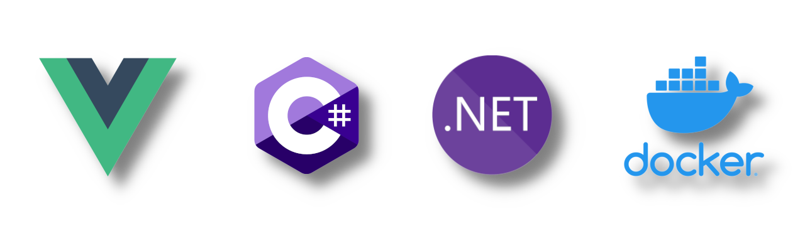
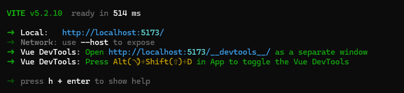

# Welcome to my GitHub Profile!

I am a passionate software developer with a love for coding and problem-solving. I enjoy working on various projects and exploring different technologies. My main areas of interest include web development, data science, and machine learning.

## My Stack

Im a full stack developer, specialized in Vue.js, C#, Dotnet and Docker. I love working with Azure and AWS too!

## What I'm Currently Working On

I'm currently focusing on enhancing my skills in front-end development and diving deeper into JavaScript frameworks like React. I'm also exploring cloud technologies and learning how to deploy scalable applications using platforms like AWS and Azure.

## How to Reach Me

If you have any questions, suggestions, or just want to connect, feel free to reach out to me. You can find me on the following platforms:

- GitHub: [TearingMoon](https://github.com/TearingMoon)
- LinkedIn: [David Torrubia](https://www.linkedin.com/in/david-torrubia-santos-341628236/)

## Fun Fact

Here's a fun fact about me: I love Star Trek.
