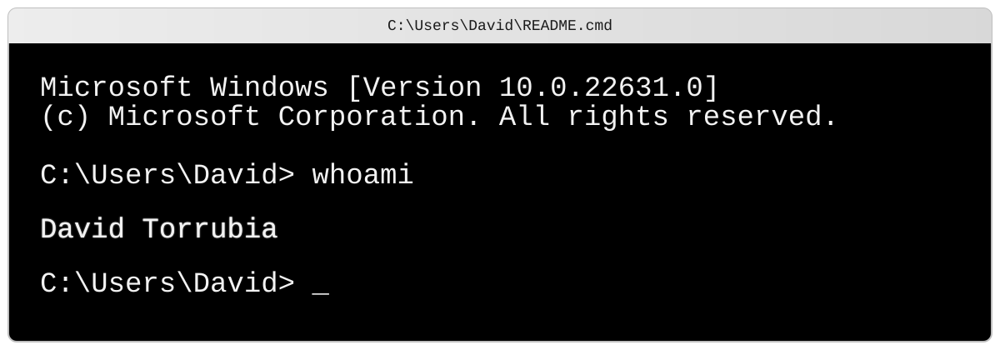

  

<h2 align="center">Software Engineering · Game Development · Simulation Systems</h2>

  I am a Software Engineering and Game Development student interested in building technical systems, videogames, simulations and tools.

  My main focus is programming applied to game engines, gameplay architecture, multiplayer systems, artificial intelligence, real-time simulations and defense-oriented software concepts.

<h2 align="center">Tech Stack</h2>

  
  
  
  
  
  
  
  

  
 And much more...

  

